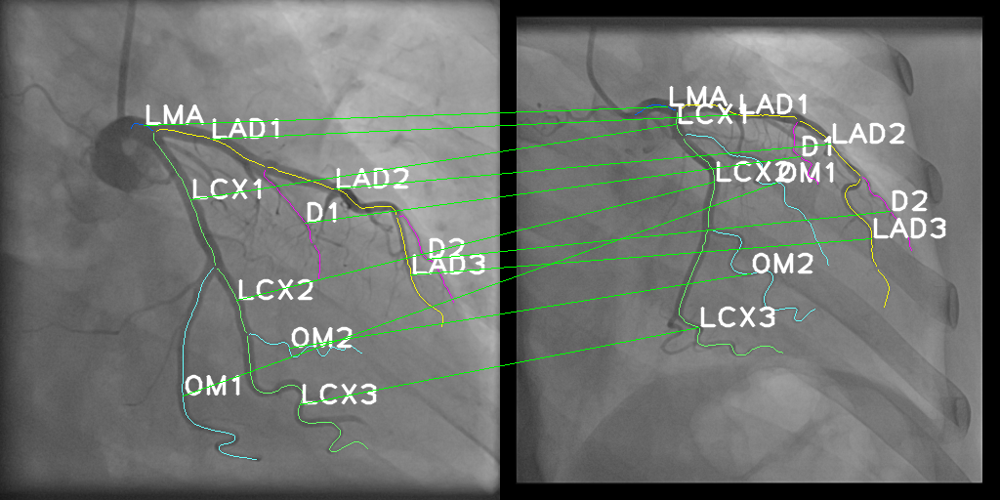

##  Code for paper 'HAGMN-UQ: Hyper Association Graph Matching Network with Uncertainty Quantification for Coronary Artery Semantic Labeling'

Chen Zhao1, Michele Esposito2, Zhihui Xu3, Weihua Zhou4,5
1. Department of Computer Science, Kennesaw State University, Marietta, GA, USA
2. Department of Cardiology, Medical University of South Carolina, Charleston, SC, USA
3. Department of Cardiology, The First Affiliated Hospital of Nanjing Medical University, Nanjing, China
4. Department of Applied Computing, Michigan Technological University, Houghton, MI, USA
5. Center for Biocomputing and Digital Health, Institute of Computing and Cybersystems, and Health Research Institute, Michigan Technological University, Houghton, MI, USA

Corresponding author: Dr. Weihua Zhou @ (whzhou@mtu.edu)

## Environment setup:

1. Tensorflow buildup on Rtx 3090 with NVIDIA525 and cuda12

2. docker environement: NGC docker, version `nvcr.io/nvidia/tensorflow:21.05-tf2-py3`

3. other related python libraries: 

- matplotlib==3.3.2
- scikit-learn==0.23.2
- scipy==1.4.1
- pybind11==2.4.3
- pytest==6.1.1
- opencv-contrib-python==4.4.0.46
- gdown==3.12.2

## Demo for graph matching

`python train.py`

## Project structure

- data: provided two ICA-generated graphs, one is used as the testing case and one is used as the template case.
- demo_output: graph matching results
- methods: models_trust.HypergraphModelTrust3, used model for coronary artery semantic labeling with uncertainty quantification
- utils: helper functions to generate hyper association graphs accoroding to ICA-generated individual graphs.
- saved_models: trained model weights
- core: data structure for arterial segments and ICA-genrated vascular graphs
- train.py: using the trained models, the function `demo` generate the graph matching results

## FINAL exp hypar parameters (default parameters are shown in the train.py )

- mlp = 2
- latent = 64
- nmp = 2
- tp = 0.1
- alpha = 0.1

